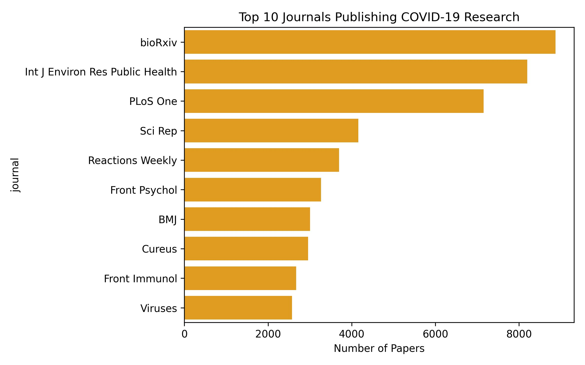
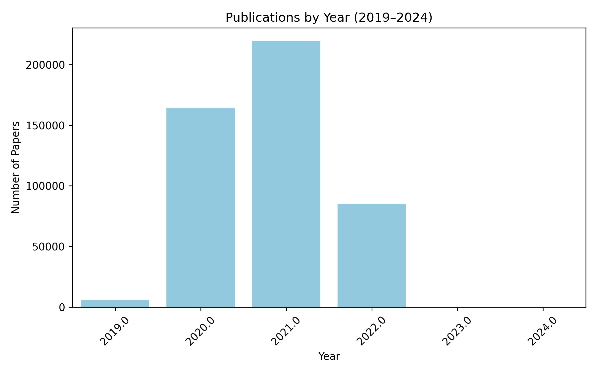

# 📊 Python Frameworks Assignment – CORD-19 Data Analysis  

## 📖 Overview  
This project explores the **CORD-19 metadata dataset** (COVID-19 research papers) using **pandas, matplotlib/seaborn, and Streamlit**.  
It demonstrates a simple **data science workflow**:  
- Data loading and cleaning  
- Exploratory data analysis  
- Visualization of trends and patterns  
- Interactive web app with Streamlit  

---

## 🎯 Objectives  
By completing this project, you will:  
✅ Practice loading and exploring a real-world dataset  
✅ Handle missing values and clean the data  
✅ Create meaningful visualizations (publication trends, top journals, word cloud)  
✅ Build a simple interactive **Streamlit app**  
✅ Present insights effectively  

---

## 🗂 Dataset  

We use the **CORD-19 metadata.csv** file, which contains:  
- Paper titles and abstracts  
- Publication dates  
- Authors and journals  
- Source information  

📥 **Download link (Kaggle)**:  
👉 [CORD-19 Research Challenge – metadata.csv](https://www.kaggle.com/allen-institute-for-ai/CORD-19-research-challenge)  

⚠️ **Important:**  
- The dataset is large, so it is **not included in this repository**.  
- After downloading, place the file in a folder named `data/` inside the project root:  

Installation

Clone the repository:

git clone https://github.com/<your-username>/Frameworks_Assignment.git
cd Frameworks_Assignment

Create a virtual environment (recommended):

python -m venv venv
source venv/bin/activate   # On Windows: venv\Scripts\activate

Install required packages:

pip install -r requirements.txt

🚀 Usage
1. Explore with Jupyter Notebook
jupyter notebook notebooks/cord19_exploration.ipynb

2. Run the Streamlit App
cd app
streamlit run streamlit_app.py

Then open your browser at the provided local URL (usually http://localhost:8501/).

## 📊 Visualizations & Findings  

### 📰 Top Publishing Journals  
The figure below shows the **Top 10 journals** that published the highest number of COVID-19 research papers in the CORD-19 dataset.  
Preprint servers like **medRxiv** and **bioRxiv** dominate, reflecting their crucial role in the rapid dissemination of COVID-19 research.

---

### 📈 Publications by Year (2019–2024)  
This bar chart displays the **number of papers published each year** from **2019 to 2024**.  
It reveals a sharp increase in 2020 and 2021, coinciding with the peak of the pandemic, followed by a gradual decline in later years.

---

### 🔑 Most Frequent Words in Paper Titles  
The word cloud below highlights the **most common keywords** found in paper titles.  
Unsurprisingly, terms such as **COVID-19**, **SARS-CoV-2**, **pandemic**, and **coronavirus** appear most frequently,  
showing the main research focus during the pandemic.

---

These visualizations together provide insights into **where**, **when**, and **what** topics dominated COVID-19 research throughout the pandemic period.

